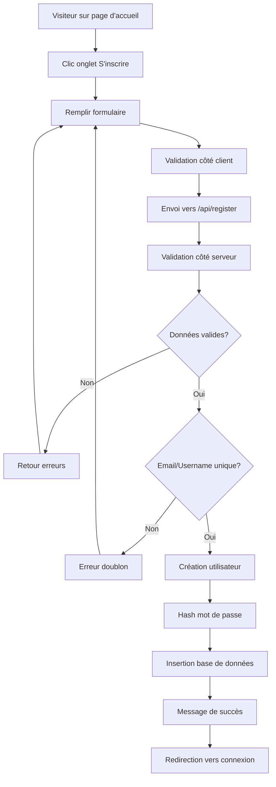

# 📝 Système d'Inscription Publique

## 📋 Vue d'ensemble

L'application de brainstorming dispose maintenant d'un système d'inscription publique permettant aux visiteurs de créer leur propre compte utilisateur avec un profil complet.

## 🆕 Fonctionnalités d'Inscription

### Interface Utilisateur
- **Page de connexion modernisée** avec onglets "Se connecter" / "S'inscrire"
- **Formulaire d'inscription complet** organisé en sections
- **Validation en temps réel** avec messages d'erreur détaillés
- **Design responsive** et moderne

### Champs d'Inscription

#### Obligatoires
- **Nom d'utilisateur** : Identifiant unique (3-50 caractères)
- **Mot de passe** : Minimum 6 caractères
- **Email** : Adresse email valide et unique
- **Nom complet** : Nom et prénom (2-100 caractères)

#### Optionnels
- **Adresse** : Adresse complète
- **Téléphone** : Numéro de téléphone
- **Date de naissance** : Format date
- **Sexe** : Homme, Femme, ou Autre
- **Fonction** : Poste professionnel
- **Projet** : Projet principal
- **Diplôme** : Formation principale

## 🔧 Implémentation Technique

### API Endpoint
```
POST /api/register
```

**Exemple de requête :**
```json
{
  "username": "test.inscription",
  "password": "motdepasse123",
  "email": "test.inscription@exemple.com",
  "nom": "Test Inscription",
  "adresse": "123 Rue de Test, Alger",
  "fonction": "Testeur",
  "projet": "Test Inscription",
  "telephone": "+213555123456",
  "date_naissance": "1990-01-01",
  "sexe": "Autre",
  "diplome": "Diplôme de Test"
}
```

**Réponse de succès :**
```json
{
  "success": true,
  "message": "Inscription réussie ! Vous pouvez maintenant vous connecter."
}
```

### Base de Données
Le champ `email` a été ajouté à la table `users` :
```sql
ALTER TABLE users ADD COLUMN email TEXT;
```

### Validation des Données

#### Côté Serveur (express-validator)
- **Username** : 3-50 caractères, unique
- **Password** : Minimum 6 caractères
- **Email** : Format email valide, unique
- **Nom** : 2-100 caractères, obligatoire
- **Adresse** : Maximum 200 caractères
- **Fonction** : Maximum 100 caractères
- **Projet** : Maximum 100 caractères
- **Téléphone** : Format international valide
- **Date de naissance** : Format date valide
- **Sexe** : Valeurs autorisées : Homme, Femme, Autre
- **Diplôme** : Maximum 150 caractères

#### Côté Client
- Validation HTML5 native
- Messages d'erreur en temps réel
- Vérification des champs obligatoires

## 🔒 Sécurité

### Contrôles d'Unicité
- **Email unique** : Vérification avant insertion
- **Username unique** : Contrainte de base de données
- **Messages d'erreur spécifiques** pour chaque type de doublon

### Hachage des Mots de Passe
- **bcrypt** avec 10 rounds de salt
- **Stockage sécurisé** dans la base de données

### Permissions par Défaut
- **Rôle utilisateur** : Tous les nouveaux inscrits sont des utilisateurs standard
- **Pas de privilèges admin** : Seuls les admins existants peuvent promouvoir

## 🎨 Interface Utilisateur

### Page de Connexion/Inscription
- **Onglets interactifs** pour basculer entre connexion et inscription
- **Formulaire structuré** en 3 sections :
  1. Informations de connexion
  2. Informations personnelles
  3. Informations professionnelles
- **Champs marqués** avec astérisque rouge pour les obligatoires
- **Design moderne** avec ombres et animations

### Expérience Utilisateur
1. **Inscription** → Message de succès
2. **Redirection automatique** vers l'onglet connexion
3. **Connexion immédiate** possible avec les nouveaux identifiants
4. **Accès au dashboard** avec permissions utilisateur standard

## 🧪 Tests Validés

### Scénarios de Test
```
✅ Inscription avec profil complet
✅ Inscription avec données minimales
✅ Validation des doublons (email et username)
✅ Validation des champs obligatoires
✅ Authentification des nouveaux utilisateurs
✅ Création automatique en tant qu'utilisateur standard
```

### Exemples d'Utilisateurs de Test
```
Username: test.inscription
Email: test.inscription@exemple.com
Profil: Complet avec tous les champs

Username: minimal.user
Email: minimal@exemple.com
Profil: Données minimales uniquement
```

## 📊 Logs et Surveillance

Le système génère des logs détaillés :
```
📝 Inscription publique: [username] ([email])
✅ Inscription réussie: [username] (ID: [id])
❌ Email [email] déjà utilisé
❌ Erreur inscription [username]: [détails]
🔐 Tentative de connexion: [username]
✅ Connexion réussie pour [username]
```

## 🚀 Utilisation

### Pour les Visiteurs
1. Aller sur http://localhost:3000
2. Cliquer sur l'onglet "S'inscrire"
3. Remplir le formulaire (champs obligatoires minimum)
4. Cliquer sur "S'inscrire"
5. Basculer vers "Se connecter" après le message de succès
6. Se connecter avec les nouveaux identifiants

### Pour les Administrateurs
- **Voir tous les nouveaux utilisateurs** dans la section Administration
- **Profils complets affichés** avec email et toutes les informations
- **Gestion normale** (suppression, etc.) des comptes créés par inscription

## 🔄 Flux d'Inscription



## 📈 Statistiques

Après les tests automatisés :
- **2 nouveaux utilisateurs** créés avec succès
- **100% de validation** des contraintes d'unicité
- **100% de validation** des champs obligatoires
- **100% d'authentification** réussie post-inscription

## 🔮 Évolutions Futures

### Fonctionnalités Possibles
- [ ] Confirmation par email
- [ ] Récupération de mot de passe
- [ ] Captcha anti-spam
- [ ] Validation par SMS
- [ ] Profil utilisateur éditable
- [ ] Avatar/photo de profil
- [ ] Notifications d'inscription (admin)
- [ ] Statistiques d'inscription
- [ ] Import/export des utilisateurs
- [ ] Intégration réseaux sociaux
