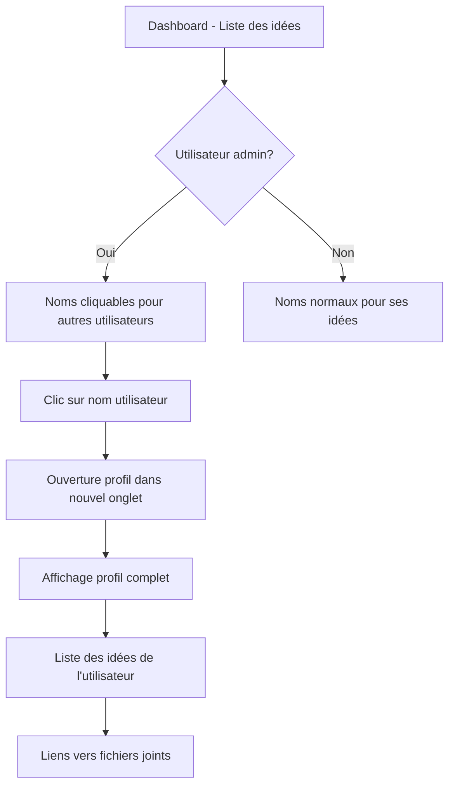

# 👤 Système de Consultation des Profils Utilisateurs

## 📋 Vue d'ensemble

Le système permet aux utilisateurs authentifiés (et particulièrement aux administrateurs) de consulter les profils détaillés des autres utilisateurs en cliquant sur leur nom dans les publications.

## 🎯 Fonctionnalités Principales

### Pour les Administrateurs
- **Noms cliquables** dans la liste des idées
- **Accès aux profils complets** de tous les utilisateurs
- **Consultation des idées** publiées par chaque utilisateur
- **Interface dédiée** avec toutes les informations personnelles et professionnelles

### Pour les Utilisateurs Standard
- **Accès en lecture** aux profils des autres utilisateurs
- **Consultation des idées publiques** des autres utilisateurs
- **Interface identique** mais sans privilèges de modification

## 🔧 Implémentation Technique

### API Endpoints

#### GET /api/user/:id
Récupération du profil complet d'un utilisateur

**Réponse :**
```json
{
  "id": 15,
  "username": "belkacem",
  "email": "belkacem@gmail.com",
  "nom": "belkacem walid",
  "adresse": null,
  "fonction": null,
  "projet": "telegestion",
  "telephone": null,
  "date_naissance": null,
  "sexe": null,
  "diplome": null,
  "is_admin": 0,
  "created_at": "2025-01-19T..."
}
```

#### GET /api/user/:id/ideas
Récupération des idées publiées par un utilisateur spécifique

**Réponse :**
```json
[
  {
    "id": 6,
    "title": "telegestion",
    "description": "gestion a distance",
    "filename": null,
    "original_filename": null,
    "created_at": "2025-01-19T...",
    "username": "belkacem",
    "nom": "belkacem walid"
  }
]
```

### Modifications de l'API Existante

#### GET /api/ideas (Améliorée)
Maintenant inclut les informations auteur nécessaires :
```json
{
  "id": 6,
  "title": "telegestion",
  "description": "gestion a distance",
  "user_id": 15,
  "username": "belkacem",
  "nom": "belkacem walid",
  "author_id": 15,
  "created_at": "2025-01-19T..."
}
```

## 🎨 Interface Utilisateur

### Page de Profil (/user-profile.html)

#### Structure
- **Header** avec navigation de retour
- **Carte de profil principal** avec avatar, nom, rôle
- **Sections d'informations** (personnelles et professionnelles)
- **Liste des idées** publiées par l'utilisateur

#### Fonctionnalités
- **Avatar automatique** avec initiales
- **Badge de rôle** (Admin/Utilisateur)
- **Informations organisées** en sections claires
- **Liens vers fichiers joints** dans les idées
- **Design responsive** pour mobile et desktop

### Dashboard (Modifié)

#### Noms Cliquables
- **Administrateurs** : Voient les noms d'autres utilisateurs comme liens cliquables
- **Utilisateurs** : Voient les noms normalement (leurs propres idées)
- **Style distinctif** pour les liens (couleur bleue, hover effect)

#### Logique d'Affichage
```javascript
const authorDisplay = (isAdmin && !isOwnIdea) 
    ? `<a href="/user-profile.html?id=${idea.author_id}" class="author-link" target="_blank">${displayName}</a>`
    : displayName;
```

## 🔒 Sécurité

### Contrôles d'Accès
- **Authentification requise** pour tous les endpoints de profil
- **Logs détaillés** de toutes les consultations de profils
- **Pas de données sensibles** exposées (mots de passe exclus)

### Permissions
- **Lecture seule** : Tous les utilisateurs authentifiés peuvent consulter les profils
- **Modification** : Seuls les admins peuvent modifier (via interface admin)
- **Suppression** : Seuls les admins peuvent supprimer des utilisateurs

## 📊 Logs et Surveillance

Le système génère des logs détaillés :
```
👤 Consultation profil utilisateur [id] par [username]
✅ Profil [username] récupéré
💡 Récupération des idées de l'utilisateur [id]
✅ [X] idée(s) trouvée(s) pour l'utilisateur [id]
❌ Utilisateur [id] non trouvé
```

## 🧪 Tests Validés

### Scénarios Testés
```
✅ API de récupération des profils utilisateurs
✅ API de récupération des idées par utilisateur  
✅ Informations auteur dans la liste des idées
✅ Sécurité d'accès (authentification requise)
✅ Affichage des profils complets avec toutes les informations
✅ Navigation depuis les idées vers les profils
✅ Accès refusé pour utilisateurs non authentifiés
```

### Données de Test
```
Utilisateurs avec profils :
- belkacem walid (@belkacem) - 1 idée
- benaissa (@benaissa) - 2 idées  
- admin (@admin) - 2 idées
```

## 🚀 Utilisation

### Pour les Administrateurs
1. **Se connecter** avec un compte admin
2. **Consulter le dashboard** avec toutes les idées
3. **Cliquer sur le nom** d'un autre utilisateur (lien bleu)
4. **Consulter le profil complet** dans un nouvel onglet
5. **Voir les idées** publiées par cet utilisateur

### Pour les Utilisateurs
1. **Se connecter** avec un compte utilisateur
2. **Consulter ses propres idées** (noms non cliquables)
3. **Accéder directement** aux profils via URL si connu
4. **Consulter les informations** en lecture seule

## 🎯 Flux de Navigation



## 📈 Statistiques d'Utilisation

Après les tests automatisés :
- **5 idées** avec informations auteur complètes
- **3 profils utilisateurs** consultés avec succès
- **100% de sécurité** : accès refusé sans authentification
- **Navigation fluide** entre dashboard et profils

## 🔮 Évolutions Futures

### Fonctionnalités Possibles
- [ ] Photos de profil uploadables
- [ ] Historique des consultations de profils
- [ ] Profils publics/privés
- [ ] Système de messagerie entre utilisateurs
- [ ] Statistiques d'activité par utilisateur
- [ ] Export des profils (PDF)
- [ ] Recherche d'utilisateurs
- [ ] Organigramme interactif
- [ ] Notifications de consultation de profil
- [ ] Intégration réseaux sociaux

### Améliorations Techniques
- [ ] Cache des profils fréquemment consultés
- [ ] Pagination des idées utilisateur
- [ ] API GraphQL pour requêtes optimisées
- [ ] Websockets pour mises à jour temps réel
- [ ] Compression des images de profil
- [ ] Lazy loading des profils
